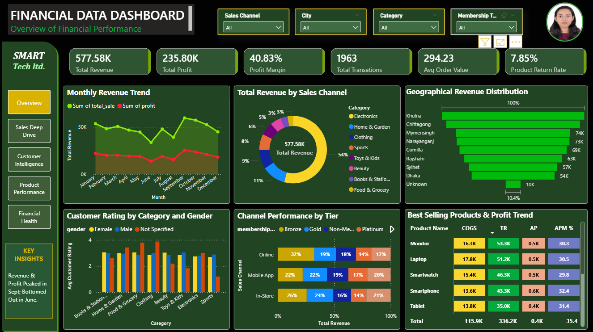
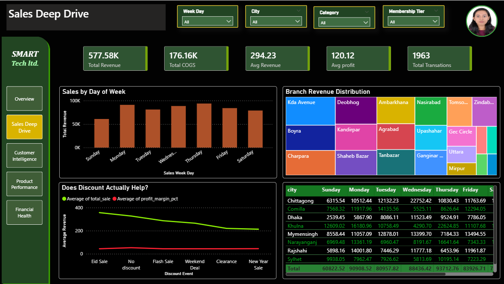
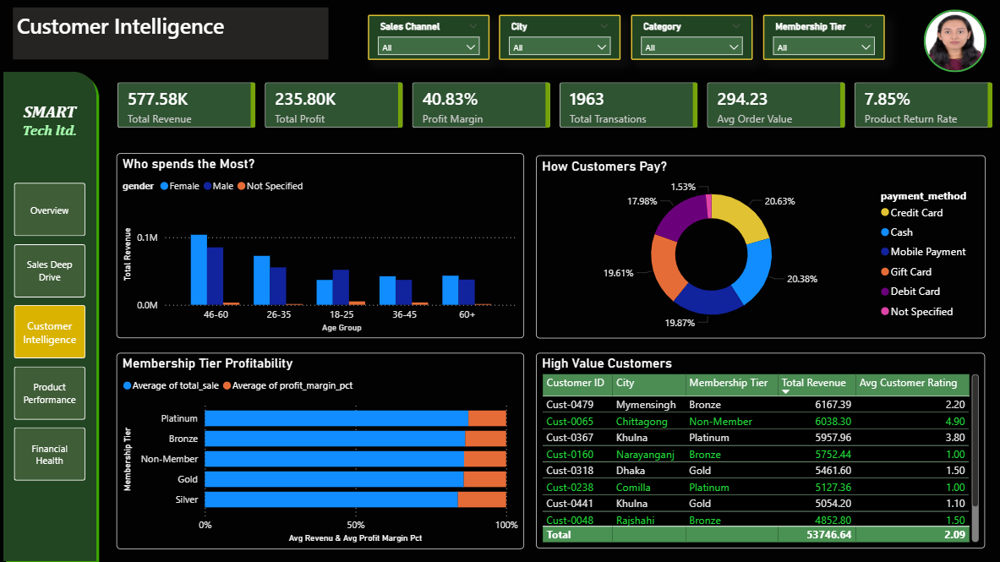
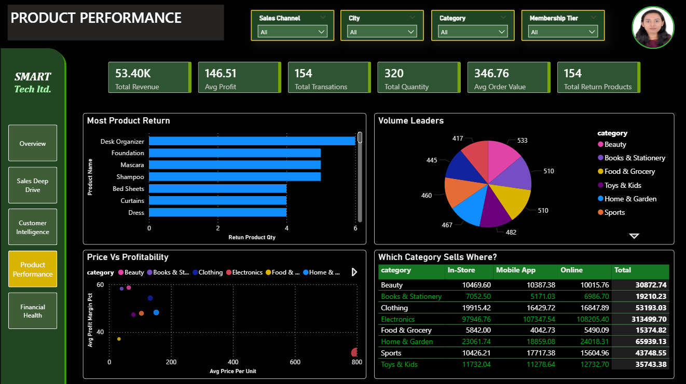
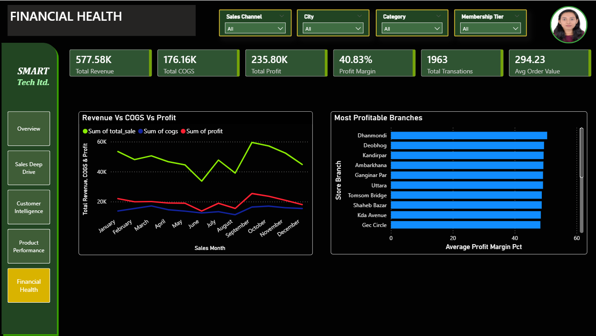

# 🏪 RetailNexus-  Unified Sales, Customer & Product Analytics Hub

 


 
 
## 📌 Project Overview
 
**RetailNexus** is an end-to-end data analytics project built on a retail sales dataset from Bangladesh. The project simulates a real-world business intelligence pipeline — starting from raw data cleaning in Python, structured storage in PostgreSQL, and finally an interactive multi-page dashboard in Power BI.
 
The goal is to give business stakeholders a single unified hub to monitor **sales performance**, **customer behavior**, **product trends**, and **financial health** — all in one place, with interactive filters.
 
> ⚠️ **Note:** The dataset used in this project is a dummy/synthetic dataset created for learning and portfolio purposes. It does not represent any real company or organization.
 

 <br>
 
## 🎯 Business Questions Answered
 
- Which cities and store branches generate the most revenue?
- Which customer segments (age group, gender, membership tier) are most valuable?
- What are the top-selling and most-returned products?
- How do sales channels (In-Store, Online, Mobile App) compare?
- Does offering a discount actually improve profit margin?
- Which months and days of the week see the highest sales?
- How is revenue trending over time vs profit?


 <br>

## 📸 Dashboard Preview

<table border="0" cellspacing="0" cellpadding="10">
  <tr>
    <td colspan="2" align="center">
      <h3>🏠 Overview</h3>
      <p><i>Main dashboard </i></p>
      
    </td>
  </tr>
  <tr>
    <td align="center" width="50%">
      <h3>📈 Sales Deep Dive</h3>
      
    </td>
    <td align="center" width="50%">
      <h3>👥 Customer Intelligence</h3>
      
    </td>
  </tr>
  <tr>
    <td align="center" width="50%">
      <h3>🛍️ Product Performance</h3>
      
    </td>
    <td align="center" width="50%">
      <h3>💰 Financial Health</h3>
      
    </td>
  </tr>
</table>


  <br>
 
## 🛠️ Tech Stack
 
| Layer | Tool | Purpose |
|---|---|---|
| Data Cleaning | Python (Pandas, NumPy) | Raw data processing & transformation |
| Database | PostgreSQL 18 | Structured data storage |
| Visualization | Power BI Desktop | Interactive dashboard |
| IDE | VS Code | Development environment |
| Version Control | Git & GitHub | Project management |
 
 <br>
 
## 📁 Project Structure
 
```
RetailNexus/
│
├── data/
│   ├── raw/
│   │   └── retail_sales_data.csv          # Original unprocessed dataset
│   └── processed/
│       └── retail_sales_data_cleaned.csv       # Cleaned dataset ready for SQL import
│
├── notebook/
│   └── cleaned_retail_sales_data.ipynb         # Data cleaning notebook (Pandas)
│
├── sql/
│   └── retail_sales_analysis_queries.sql       # Table creation + all analysis queries
│
├── dashboard/
│   └── Retail_Sales_Dashboard.pbix              # Power BI dashboard file
│
├── requirements.txt
├── .gitignore
├── LICENSE
└── README.md
```
 

  <br>
 
## ⚙️ Pipeline — How It Works
 
```
Raw CSV Data
     │
     ▼
Python (Pandas, Numpy) ── Data Cleaning & Transformation
     │
     ▼
PostgreSQL ── Structured Storage (retail_sales table)
     │
     ▼
Power BI ── Connect via PostgreSQL connector
     │
     ▼
Interactive Dashboard (5 pages)
```
 
 <br>
 

 
## 📂 Dataset Information
 
| Property | Value |
|---|---|
| Source | Synthetic / Dummy Dataset |
| Total Rows | 1,963 transactions |
| Total Columns | 25 |
| Date Range | 2023 – 2024 |
| Geography | Bangladesh (Dhaka, Chittagong, Sylhet, Khulna, Rajshahi, etc.) |
| Categories | Electronics, Clothing, Food & Grocery, Home & Garden, Sports, Beauty |

 <br>
 
## 🚀 How to Run This Project
 
### Prerequisites
- Python 3.x with `pandas`, `numpy` installed
- PostgreSQL 14+ installed
- Power BI Desktop (Windows only, free)
### Step 1 — Clone the Repository
```bash
git clone https://github.com/bithiNath/RetailNexus.git
cd RetailNexus
```
 
### Step 2 — Set Up Python Environment
```bash
python -m venv venv
venv\Scripts\activate        # Windows
pip install pandas numpy jupyter
```
 
### Step 3 — Run the Cleaning Notebook
```bash
jupyter notebook notebook/cleaned_retail_sales_data.ipynb
```
Run all cells — cleaned CSV will be saved to `data/processed/`.
 
### Step 4 — Set Up PostgreSQL
```bash
psql -U postgres
```
```sql
CREATE DATABASE retailnexus_db;
\c retailnexus_db
```
Then run the SQL file:
```bash
psql -U postgres -d retailnexus_db -f sql/retail_sales_analysis_queries.sql
```
Then import the CSV:
```sql
\copy retail_sales FROM 'data/processed/retail_sales_data_cleaned.csv'
WITH (FORMAT csv, HEADER true, DELIMITER ',', NULL '');
```

### Step 5 — Connect Power BI to PostgreSQL
- Open Power BI Desktop
- Click **Get Data** → Select **PostgreSQL**
- Server: `localhost` | Database: `retailnexus_db`
- Load the `retail_sales` table
- Recreate the dashboard visuals as shown in the screenshots above
  
  <br>
 
 
## **🔑 Key Insights :**

a. **📊 High-Level KPIsRevenue & Profit:**
  Total Revenue stands at 577.58K with a Total Profit of 235.80K, yielding a strong `40.83% Profit Margin`.
  - **Order Metrics:** A total of `1963 transations` were processed with a healthy `Average Order Value (AOV) of 294.23`.
  - **Product Returns:** The product return rate is kept low at 7.85%.
  
b. **📈 Sales & Revenue TrendsSeasonal Peak:** Monthly revenue and profit remain stable mid-year but experience a massive surge, peaking sharply in September and October.
  - **Dominant Category:** Electronics is the primary revenue driver, contributing over half of the `total revenue at 54%`. `Home & Garden (11%)` and `Clothing (9%)` follow.
  - **Geographical Distribution:** Khulna and Chittagong regions outperform all other locations, securing the highest shares in geographical revenue distribution.
  
c. **👥 Customer & Channel DemographicsCustomer Satisfaction:** Average customer ratings remain consistently high (between 3 and 4 stars) across all categories, showing no significant variation between male and female buyers.
 - **Tier Performance:** Across Online, and In-Store channels, Bronze membership holders contribute the largest share of `total revenue (ranging from 26% to 32%)`.
  
d. **🏆 Product PerformanceTop Revenue Generators:** `Monitors (53.3K)` and `Laptops (51.2K)` lead the chart as the `highest-selling products` by total revenue.
 - **Highest Efficiency:** While monitors sell the most, Smartphones yield the highest `Average Profit Margin percentage (32.4%)`.
 
  <br>
 
## 👤 Author

- **GitHub:** [@bithiNath](https://github.com/bithiNath)
- **LinkedIn:** [Bithi Nath](https://linkedin.com/in/bithinath)


 <br>
 
## 📄 License
 
This project is licensed under the MIT License — see the [LICENSE](LICENSE) file for details.
 
<br>
 
## 🙏 Acknowledgements
 
- Dataset is synthetic and created purely for educational and portfolio purposes
- Built as part of a self-learning journey in Data Analytics
- Tools used: Python, PostgreSQL, Power BI Desktop, VS Code, Git
 
<br>

-----
<p align="center">⭐ If you found this project helpful, please consider giving it a star on GitHub!</p>


<p align="center">Developed by <a href="https://github.com/bithiNath">@bithiNath</a> ⚡</p>

